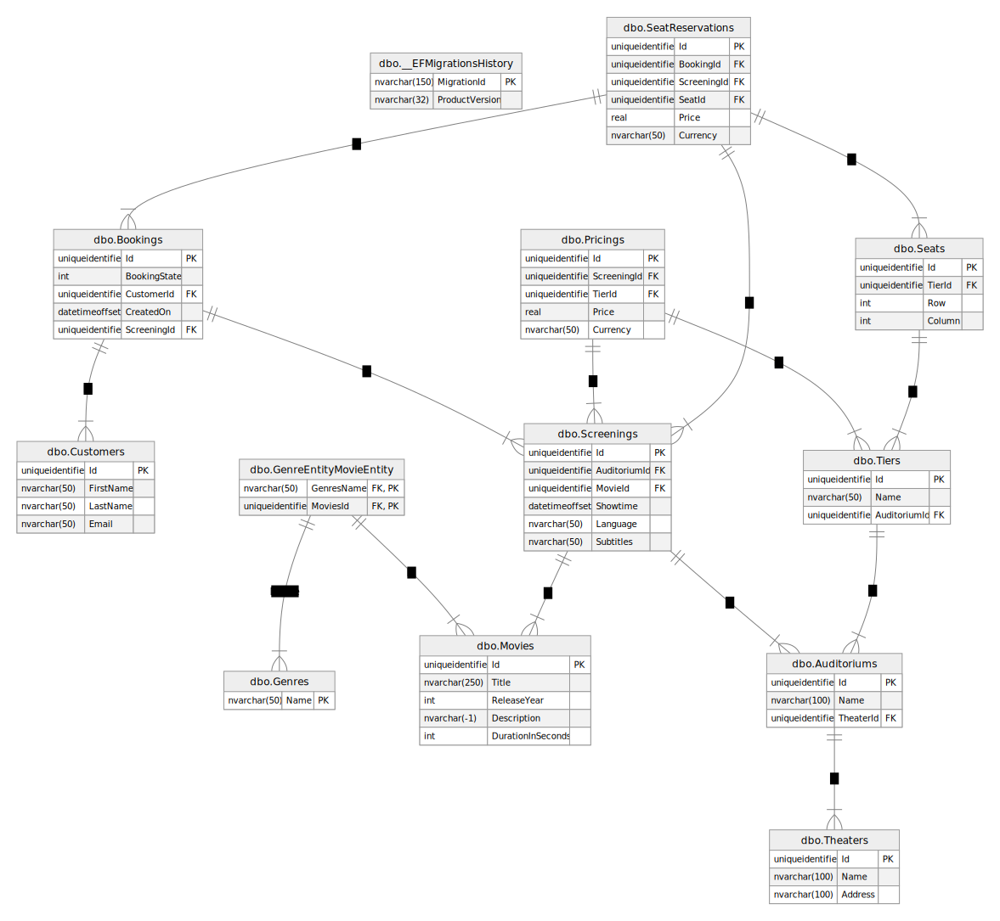

# Architecture

The **CinemaTicketBooking** solution is structured according to the [Clean Architecture](https://blog.cleancoder.com/uncle-bob/2012/08/13/the-clean-architecture.html):

## The projects of the solution

The projects are representing the different layers:
 - **CinemaTicketBooking.Web**: Presentation layer implementing a web API with [ASP.Net Core](https://dotnet.microsoft.com/en-us/apps/aspnet).
   This project also serves as the startup project. If the solution would need to be used with another presentation layer,
   for example a CLI, then a new project, with that presentation layer needs to be added.
   This new project should then be used with a CLI focused configuration as the startup project.
   The presentation layer triggers use cases to serve the requests it gets from the user.
   This layer is responsible for transforming the domain entities to/from the DTOs via [Automapper](https://github.com/AutoMapper/AutoMapper).

- **CinemaTicketBooking.Application**: Application layer contains the use cases, via the user requests can be served.
  It defines the interfaces for the use cases so they can be used via dependency injection once the service collection of the project is configured during startup.
  Besides this, the project contains the repository interfaces that describe the classes the persistency layer shall implement.

- **CinemaTicketBooking.Infrastructure**: Persistence layer providing database access via [Entity Framework Core](https://learn.microsoft.com/en-us/ef/core).
  Currently the project only supports [SQL Server](https://learn.microsoft.com/en-us/ef/core/providers/sql-server/?tabs=dotnet-core-cli) as database.
  The database provider specific code is separated and shall be accessed via a factory.
  The repositories can be used via dependency injection once the service collection of the project is configured during startup.
  This layer is responsible for transforming the domain entities to/from infrastructure entitites via [Automapper](https://github.com/AutoMapper/AutoMapper).

- **CinemaTicketBooking.Domain**: Domain layer containing the entities the application layer's use cases work on.
  These classes represent the data the whole solution is about. This layer does not have any dependencies.

- **CinemaTicketBooking.IntegrationTests**: Contains tests that involve more than one project.
  Typically these are tests that involve a test database. Test databases are created with [LocalDb](https://github.com/SimonCropp/LocalDb).

- **CinemaTicketBooking.XXX.UnitTests**: Contains the unit tests of the related project.
  These projects have access to the internal members of the project they test.

The dependencies between the layers are configured in the `.csproj` files of the projects:

## Database tables

The entities of the infrastructure layer represents the database tables:

From these entities the follwing tables are created:

*Generated with the [Schema Visualization Azure Data Studio Extension](https://github.com/R0tenur/visualization)*
